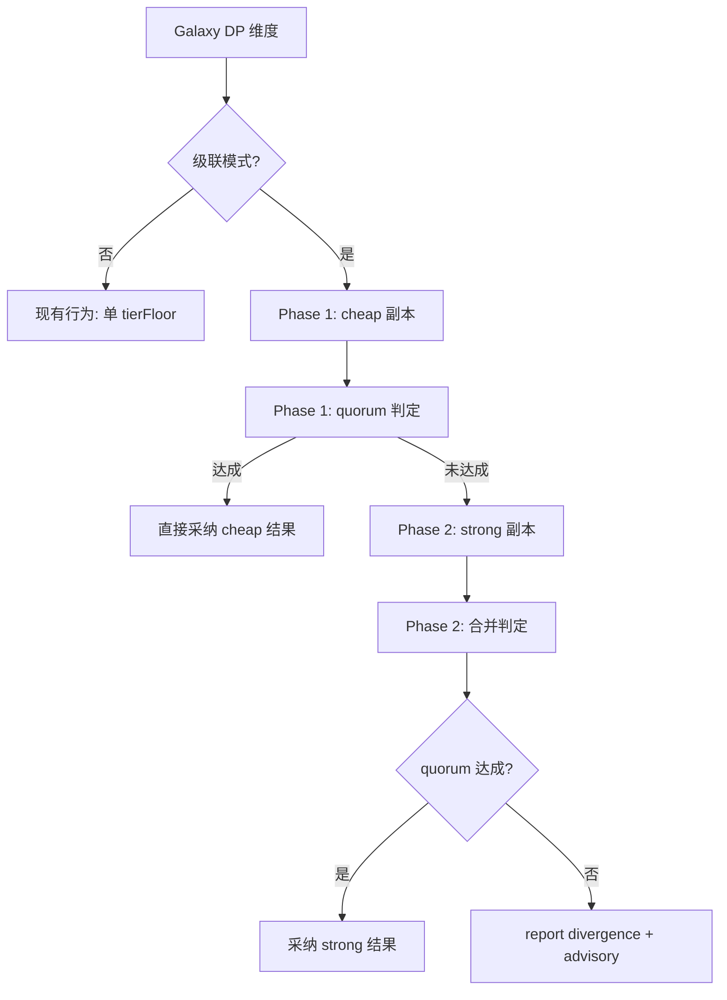

# 级联 Tier 推测执行

> 借鉴 DeepSeek MoE "多数 token 用 37B 参数，难的 token 激活更多计算" 的哲学，将天枢 Galaxy 的 DP 副本 + quorum + tierFloor 三层机制串联为级联推测链：cheap 先行 → quorum 把关 → strong 兜底。

## 背景

当前 Galaxy DP 机制：所有副本使用同一模型（由 `tierFloor` 决定）。如果 `tierFloor: 'strong'`，所有副本都用 v4（贵）；如果 `tierFloor: 'cheap'`，所有副本都用 v4-flash（便宜但可能不可靠）。

DeepSeek MoE 的哲学：**多数 token 只需 37B 参数，少数高难 token 才激活更多专家**。这对应到多 agent 场景：多数任务 cheap 模型就够了，少数 ambiguous case 才需要 strong 模型。当前 Galaxy 的 DP 机制是"全有或全无"——要么全 cheap 要么全 strong。

**级联推测**：DP 副本先用 cheap 跑 → 结果一致且 quorum 通过 → 直接采纳（最低成本）。结果不一致或 quorum 未达成 → 自动 escalate 到 strong 模型重评分歧点。90% 场景 cheap 足够，10% 触发 escalation。

## 设计

### 数据流



### Schema 扩展

`dimensionSchema` 新增字段：

```typescript
cascadeTier: z.object({
  enabled: z.boolean().default(false),
  cheapTier: z.enum(['cheap', 'balanced']).default('cheap'),
  escalateTier: z.enum(['balanced', 'strong']).default('strong'),
}).optional()
```

当 `cascadeTier.enabled = true` 时，忽略 `tierFloor` 的单一值，改为两级：
- Phase 1：`cascadeTier.cheapTier` 的副本（默认 cheap，即 v4-flash）
- Phase 2（仅在 Phase 1 quorum 未达成时触发）：`cascadeTier.escalateTier` 的追加副本

### 实现链路

```
galaxy.ts dimensionSchema 加 cascadeTier
  → execute 检测 cascadeTier.enabled
    → Phase 1: 构造 requests（tierFloor = cheapTier, replicas = N）
    → delegateBatch(requests, policy)
    → checkDpQuorum(dataParallelGroups, resultsById)
    → quorum 达成 → 直接返回
    → quorum 未达成：
      → Phase 2: 构造追加 requests（tierFloor = escalateTier, replicas = N, objective 标注分歧点）
      → delegateBatch(追加 requests, policy)
      → 合并 Phase 1 + Phase 2 结果
      → formatGalaxyResult 标注 "escalated: cheap quorum not reached, strong verification applied"
```

### 关键决策

**1. Phase 2 的副本数**：与 Phase 1 相同（`replicas`）。两个 cheap 副本分歧 → 两个 strong 副本介入。

**2. Phase 2 的 objective**：带 Phase 1 的分歧信息。不是重新执行整个任务，而是"验证以下分歧点"——缩小范围，减少 strong 模型的 token 消耗。

**3. 结果合并**：Phase 2 完成后，不丢弃 Phase 1 的结果。Phase 1 cheap 副本的缓存数据（`cache_read_input_tokens`）对 Phase 2 的 strong 副本有效（前缀缓存按模型隔离，但服务端可能实现跨模型共享）。

**4. quorumK**：Phase 1 和 Phase 2 各用自己的 replicas 计算 quorum（`floor(N/2)+1`）。如果 Phase 2 仍然 quorum 失败 → 报告 genuine divergence（不重复 escalate）。

**5. 成本模型**：cheap 副本（v4-flash）的 token 成本约为 strong（v4）的 1/3–1/5。级联模式在 90% 场景（cheap 共识）下成本 = 2×cheap（vs 当前全 strong 的 2×strong），节省约 60–80%。10% escalation 场景下成本 = 2×cheap + 2×strong（vs 2×strong），增加约 30–50%。期望成本 = 0.9 × (2×cheap) + 0.1 × (2×cheap + 2×strong) = 2×cheap + 0.2×strong，显著低于 2×strong。

**6. escalation 的 tierFloor 必须高于 cheapTier**：`escalateTier` 必须是比 `cheapTier` 更高的 tier（balanced > cheap, strong > balanced）。如果用户错误配置（eq. `cheapTier: 'strong', escalateTier: 'cheap'`），fail-closed：拒绝执行并返回 error。

### 报告格式

```
DP verify: execution quorum not reached (0/2, quorum 2) [cheap tier]
  → escalating to strong tier for verification
DP verify: execution quorum reached (2/2, quorum 2) [strong tier]
  ⚠ escalated: cheap tier consensus failed; strong tier verification passed.
  replica cacheRead: 120K / 130K | 250K / 260K
```

## 边界条件

| 场景 | 行为 |
|------|------|
| Phase 1 quorum 达成 | 直接返回，无 Phase 2 |
| Phase 1 quorum 失败 + Phase 2 quorum 达成 | 报告 escalated，采纳 strong 结论 |
| Phase 1 quorum 失败 + Phase 2 quorum 失败 | genuine divergence——报告 advisory，主 agent 自行判断 |
| Phase 1 部分 blocked | 可用副本数不足 quorum → 触发 Phase 2（只对 blocked 副本补跑） |
| 用户 abort Phase 1 中 | 不触发 Phase 2，返回已有 partial 结果 |
| cascadeTier 与 tierFloor 同时设置 | cascadeTier 优先；tierFloor 只影响 non-DP 维度的模型选择 |

## 与现有设施的衔接

| 现有设施 | 角色 |
|----------|------|
| `tierFloor` schema（`galaxy.ts:78`） | Phase 1/2 的 tier 参数 |
| DP `replicas` + `parallelism: 'data'` | 副本数 |
| `checkDpQuorum`（`galaxy.ts`） | quorum 判定 |
| `tierTimeoutMultiplier`（`profile-registry.ts`） | Phase 2 strong 超时自动放大 |
| Galaxy 两阶段确认（proposal→confirm） | 级联推测在 confirm 之后自动执行，无需额外确认 |

## 不变量

- **绝不降级**：escalateTier 必须 ≥ cheapTier（fail-closed 校验）
- **不丢 Phase 1**：Phase 2 是追加，不覆盖 Phase 1 结果
- **最多两级**：只支持 cheap→strong 两级。不支持 cheap→strong→stronger 的 N 级链
- **DP only**：级联模式仅在 `parallelism: 'data'` 维度生效。`parallelism: 'expert'` 维度（多 authority 单副本）不走级联

## 测试要点

- Phase 1 quorum 达成 → 无 escalation，`isError` 为 undefined
- Phase 1 quorum 失败 → 自动追加 strong 副本
- Phase 2 quorum 达成 → 报告含 "escalated" 标注
- Phase 2 quorum 失败 → genuine divergence advisory
- cheapTier ≥ escalateTier → error 拦截
- cascadeTier 与 tierFloor 同时设置 → cascadeTier 优先
- coordinator 收到两次 `delegateBatch` 调用（Phase 1 + Phase 2）
